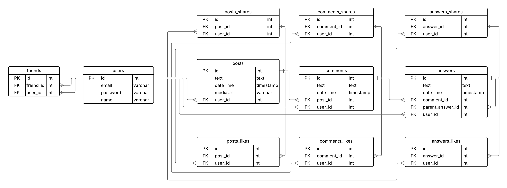

# Backend_social_media_project
Projeto de estudo em express e React: uma rede social web inspirada no Facebook, desenvolvida para praticar conceitos de front-end e integração com backend.

## Diagrama Entidade-Relacionamento

